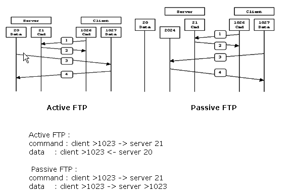
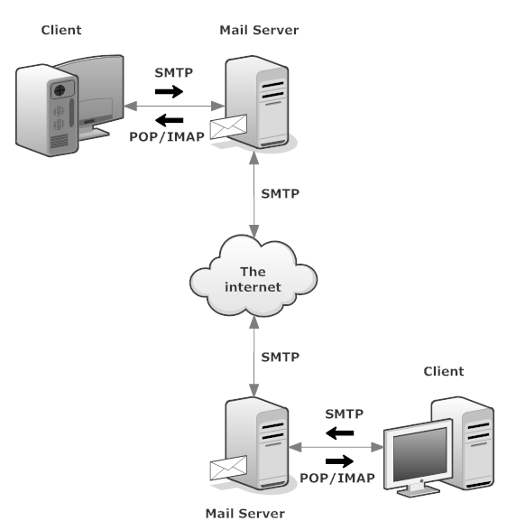
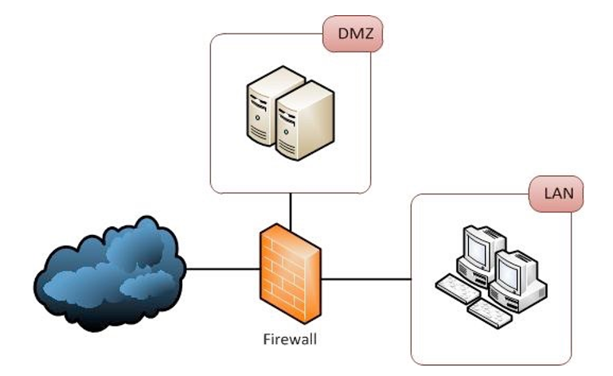
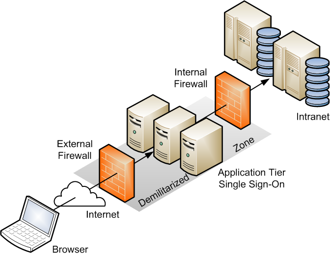
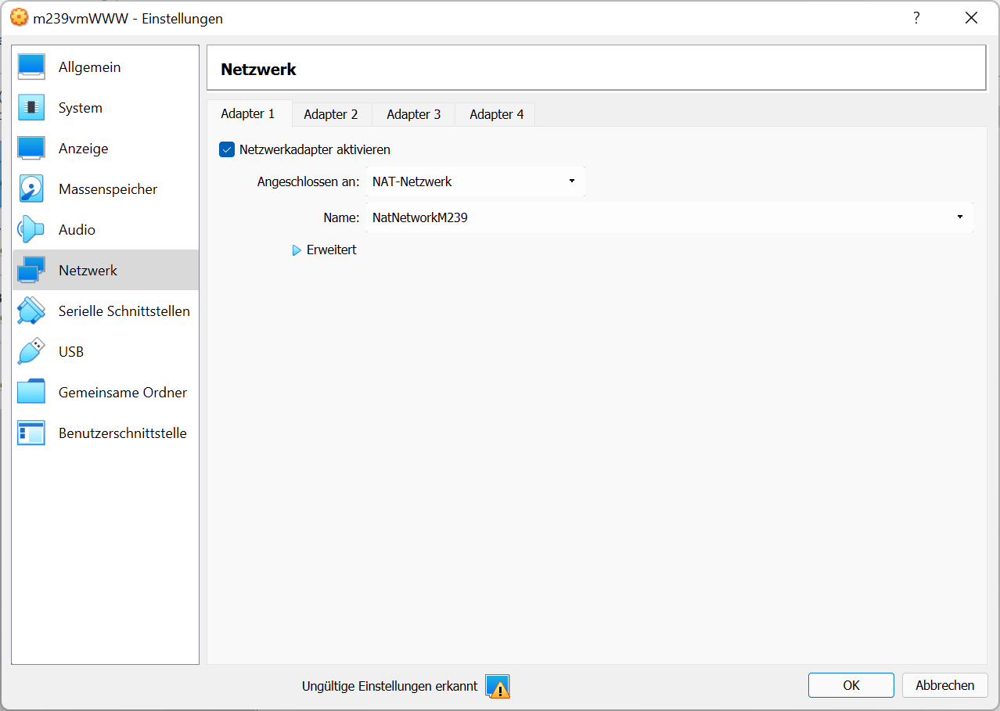
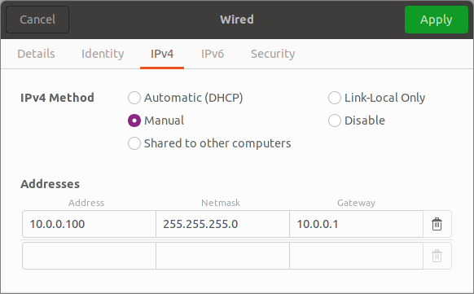
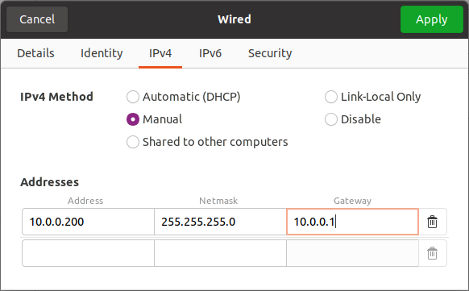
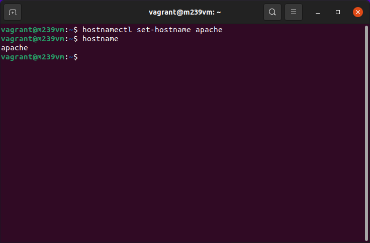
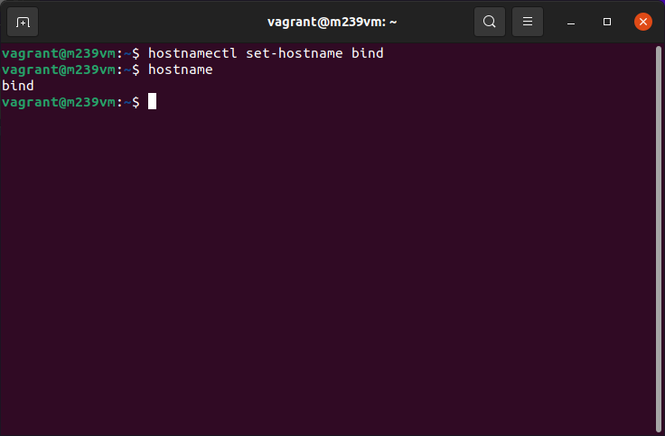
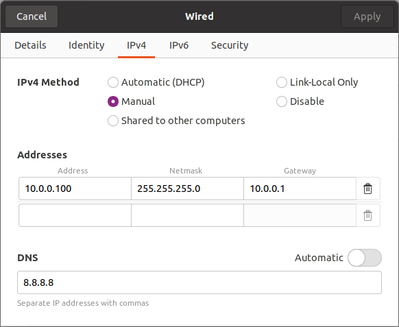

# Tag 1

<tagbar>
    
Intranet
Extranet

Internet

DNS

WWW

HTTP

HTML

LAB-Infrastruktur

</tagbar>

## 1 Repetitionsfragen

### 1.1 Einführung ins Thema

- **Welche Eigenschaften haben "Internetserver", unabhängig von ihrer Technik oder Services, gemeinsam?**  
Betrieb von Servern, welche Dienste über das Netzwerk anbieten.  
Verfügbarkeit, Datenschutz, Datensicherheit

- **Definieren Sie Verfügbarkeit**  
Dienste werden typischerweise 24/7 betrieben/genutzt. Dies macht die Wartung natürlich schwieriger und Anforderungen an die Verfügbarkeit höher.

- **Weshalb spielt Security bei Internetservern eine zentrale Rolle?**  
Datenschutz wird immer wichtiger. Daher das die Verfügbarkeit immer auf 24/7 sein soll, hat man nicht viel Zeit um im Notfall ein Backup wiederherzustellen. Daher ist es wichtig das man die Server immer wieder auf ihre Funktionsfähigkeit überprüft. 

- **Beschreiben Sie die drei Begriffe in eigenen Worten. Wo kann ein Webserver platziert werden? Wo kann ein Mailserver platziert werden? (Intranet, Extranet, Internet)**  
Intranet -> Lokales, unternehmenseigenes Netzwerk. Nur Leute in diesem Netzwerk können hier zugreifen.  
  
Extranet -> Technisch gehört es zum Intranet, allerdings ist es für Externe gedacht. Oft wird es für den Datenaustausch mit Externen genutzt. Es befindet sich zwar im internen Netzwerk, allerdings ist es abgesichert vom normalen Netzwerk.  
  
Internet -> Das bekannte, weltumspannende und öffentliche Netzwerk. Für jeden verfügbar. 
  

- **Vergleichen Sie "statische" Webseiten mit "dynamischen" Webseiten**  
Statisch -> Klassische Webanwendung. Veraltet aber in manchen Bereichen ist sie noch hilfreich.  
Dateitypen: HTML, CSS, TXT  
  
Dynamisch -> Die HTML-Datei passt sich am Nutzen vom User an.  
Dateitypen: PHP, ASP, PERL, VB, JAVA

- **Nennen Sie die beiden Betriebsmodi von FTP. Beschreiben Sie sie kurz in eigenen Worten**  
Bei FTP gibt es immer eine Command-Verbindung und eine Data-Verbindung. Die Command-Verbindung funktioniert immer gleich. Die Data-Verbindung ist bei Active- & Passive-Mode verschieden.  
  
Active -> Hier wird vom Server eine Verbindung über den Port 20 aufgebaut. Auf dem Client geht die Verbindung über einen Port über 1023.  
  
Passive -> Hier wird vom Client eine Verbindung auf den Server aufgebaut. Dabei bestimmt der Server über welchen Port diese Verbindung geht (Port 1023+). 
  

- **Benennen Sie die wichtigsten Protokolle für Email**  
SMTP -> Simple Mail Transfer Protocol  
Port -> TCP-25 (SSL/TLS TCP-465)  
Zuständig für Auslieferung von Mails.  
  
POP3 -> Post Office Protocol  
Port -> TCP-110 (SSL/TLS TCP-995)  
Zuständig für das Abholen von Mails.  
  
IMAP -> Internet Message Access Protocol  
Port -> TCP-143 (SSL/TLS TCP-993)  
Synchronisiert Mail-Inhalte mit einem IMAP-Mailserver.  
  
  
Auf der Abbildung kann man sehen wo die Protokolle genutzt werden. Zwischen Client und Server können alle Protokolle genutzt werden und für die Synchronisation zwischen Mailservern kann nur SMTP genutzt werden.

### 1.2 Grundlagen - Netzwerkaufbau (bezgl. DNS und WWW)

- **Definieren Sie in eigenen Worten was eine DMZ ist**  
Eine DMZ (Demilitarisierte Zone) ist ein Computernetz mit nur sehr eingeschränkten Zugriffsmöglichkeiten.

- **Beschreiben Sie kurz den Unterschied zwischen internen und externen Diensten. Beschreiben Sie Beispiele.**  
Interne Dienste -> Dienste, die nur für den internen Gebrauch gedacht sind. (z.B. Sharepoint)  
  
Externe Dienste -> Dienste, die von Extern auch erreichbar sein sollen (aber auch Intern) (z.B. Website)

- **Beschreiben kurz und knapp die Unterschiede der beiden Archtiketurformen (Einstufige vs. Zweistufige DMZ)**  
1-S-DMZ -> Eine einzige Firewall kümmert sich um den Datenverkehr von Intern und Extern und leitet diese richtig weiter.  
Vorteile -> Einfacher Aufbau, günstig  
Nachteile -> Grosse Gefahr bei Fehlkonfiguration, *Single Point of Failure* (wenn die eine Firewall kaputt geht, ist alles kaputt)  
  
  
  
2-S-DMZ -> In einer zweistufigen DMZ ist das DMZ-Segment zwischen zwei Firewalls gepackt. Somit verwaltet eine FW den internen Gebrauch und eine FW den externen Gebrauch. Idealerweise nutzt man zwei FW von unterschiedlichen Herstellern, damit ist bei einer Sicherheitslücke nur eine betroffen.  
Vorteile -> Hohe Sicherheit, mehr Flexibilität, mehr Konfigurationssicherheit  
Nachteile -> Mehr Verwaltungsaufwand  
  

### 1.3 Grundlagen HTTP und HTML

- **Beschreiben Sie das Protokoll HTTP in eigenen Worten. Das Adjektiv "zustandslos" soll dabei ebenfalls erklärt werden**  
HTTP -> Hypertext Transfer Protocol (zustandloses Protokoll)  
Wird genutzt für die Übertragung von Daten über das Netzwerk. Der meist genutzte Fall ist das Hosten von Webseiten, kann allerdings für viel mehr genutzt werden.  
  
Zustandslos -> Information aus früheren Anfragen gehen verloren. D.h. sobald die Seite neu geladet wird, werden alle Daten wieder vom Server geholt (theoretisch, sie werden im Cache zwischengespeichert).

- **Es gibt zwei grundsätzliche Message-Typen - nennen Sie sie.**  
Anfrage (Request) ->  Wird vom **Client** an den **Server** gesendet  
  
Antwort (Response) -> Reaktion auf die Request, sendet der **Server** zum **Client**

- **Eine HTTP-Nachricht besteht aus 2 Teilen - welchen?**  
Nachrichtenkopf (Message Header, HTTP-Header) -> Enthält Information über den Message Body, z.B. Kodierung und Inhaltstyp.  
  
Nachrichtenrumpf (Message Body, Body) -> Enthält die eigentlichen Nutzdaten.

- **Es gibt zwei verbreitete Arten, um Variablen an einen Server zu übermitteln. Welche? Beschreiben Sie sie!**  
GET -> Die meistgenutzte Methode. Daten die an der Server gesendet werden sollen, werden direkt in der URL geschrieben.  
  
POST -> Die POST-Methode schreibt die Variablen in die HTTP-Request und schickt sie dann an den Server. Damit sind die Variablen für den User nicht direkt sichtbar.

- **Benennen Sie die wichtigsten Statuscodes von HTTP**  
1xx (Information) -> Anfrage braucht länger als normal. Da viele Clients nach einer bestimmten Zeit einen Timeout geben. Wird dieser Statuscode genutzt, um mitzuteilen das es länger braucht.
  
2xx (Erfolgreich) -> Anfrage wurde erfolgreich bearbeitet und die die Antwort wird jetzt gesendet.  
  
3xx (Umleitung) -> Wenn die angefragte Seite ein Umleitung ist, wird dieser Statuscode angezeigt.  
  
4xx (Client-Fehler) -> Bei der Anfrage gab es einen Fehler. Der wohl bekannteste Statuscode ist der 404 (nicht existierendes Dokument).  
  
5xx (Server-Fehler) -> Wird diser Statuscode angezeigt, kann der Client nichts dafür. Da hat der Serveradministrator was falsch gemacht.  
  
[Übersicht Statuscodes](https://developer.mozilla.org/de/docs/Web/HTTP/Status)

## 2 LAB-Infrastruktur aufbauen

### 2.1 NAT-Network erstellen

Um ein ein NAT-Network zu erstellen, muss in VirtualBox unter "Datei" > "Einstellungen..." > "Netzwerk", ein neues Netzwerk erstellt werden. Folgend kann man die Einstellungen für das NAT-Network sehen.  

### 2.2 Import der VMs

Um die VMs zu erstellen kann das OVA-Image von Moodle heruntergeladen werden und installiert werden. Wurden beide VMs erstellt, muss das neue NAT-Network hinzugefügt werden. Mit einem Rechtsklick auf die VM und dann "Ändern..." > "Netzwerk", kann bei "Angeschlossen an", "NAT" gewählt werden. Unter dem Feld "Name", kann das NAT-Network ausgewählt werden.  

> [!WARNING]
> Die VMs müssen zwei verschiedene MAC-Adressen haben, sonst kann es zu Fehlern kommen

### 2.3 Konfiguration

#### 2.3.1 IP

In der VM kann oben rechts unter "Wired Connecting" > "Wired Settings" und dann auf das Rad bei "Wired" > "IPv4" die IP eingestellt werden.

VM1 (WWW):  

VM2 (DNS):  

#### 2.3.2 Hostname

Um den Hostname zu ändern kann im Terminal folgender Befehl eingegeben werden: `hostnamectl set-hostname NAME`. Mit `hostname` kann überprüft werden, ob der Hostname geändert wurde.

VM1 (WWW):  

VM2 (DNS):  

#### 2.3.3 Host-Datei

Damit die andere Maschine über den Hostname gepingt werden kann, muss in der Host-Datei der Hostname und die IP eingetragen werden. Die Host-Datei befindet sich unter `/etc/hosts`.

VM1 (WWW):

VM2 (DNS):

#### 2.3.4 Google-DNS-Server

Um einen DNS-Server zu hinterlegen (in unserem Fall der von Google), kann wie beim Kapitel 2.3.1 weiter unten der DNS hinterlegt werden.  

---

Quellen: [Skript Moodle](https://moodle.bztf.ch/pluginfile.php/154386/mod_resource/content/1/site/01_script/025_RepetitionsFragen/), [Bild Intranet, Extranet, Internet](https://moodle.bztf.ch/pluginfile.php/152044/mod_resource/content/1/site/img/script/extranetIntranetInternet.gif), [Bild FTP Active/Passive Mode](https://moodle.bztf.ch/pluginfile.php/152044/mod_resource/content/1/site/img/script/activePassiveFTP.png), [Bild SMTP, POP3, IMAP](https://moodle.bztf.ch/pluginfile.php/152044/mod_resource/content/1/site/img/script/smtpImapPop.png), [Bild 1-S-DMZ](https://www.bien.nl/Linux-Firewall-DMZ-LAN.PNG), [Bild 2-S-DMZ](https://docs.oracle.com/cd/E37670_01/E36387/html/images/deplarch2.png), [GET und POST Methode](https://www.ionos.de/digitalguide/websites/web-entwicklung/get-vs-post/)