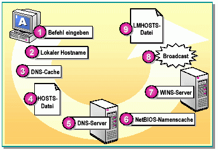
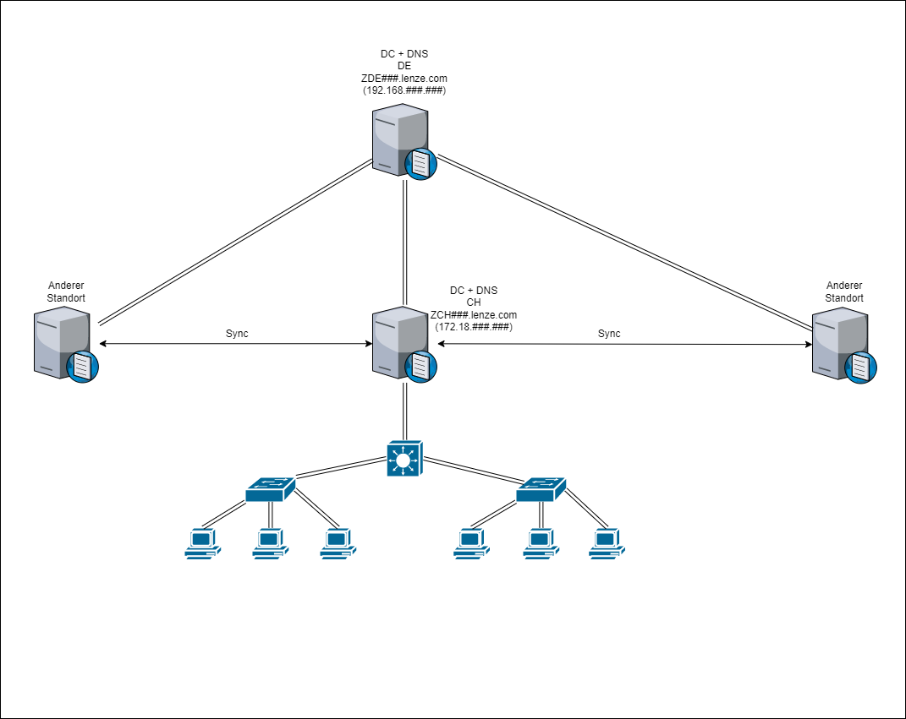

# Tag 2

## 1 Repetitionsfragen

- **Weshalb gibt es DNS?**  
Wir Menschen sind gut im Namen merken, allerdings können wir uns Zahlen nicht gut merken. Bei Computern ist es anders, diese können besser mit Zahlen arbeiten. Daher gibt es den DNS (Domain Name System). Er kann Namen zu IP's umwandeln und IP's zu Namen.  
Aus diesem Grund gibt es den Dienst DNS.

- **Beschreiben Sie was auf dem Windows-Client passiert, wenn Sie eine Webseite aufrufen wollen**  
Bevor ein DNS-Server angesprochen wird, versucht der Client selber die Namensauflösung zu machen.  
  
1 **Befehl eingeben:** Der Client macht als ersten eine einfache Namensauflösung per `ping` oder `nslookup`.  
2 **Lokaler Hostname:** Danach wird überprüft ob der Name dem lokalem Host entspricht.  
3 **DNS-Cache:** Entspricht es nicht dem lokalem Namen, wird der DNS-Cache überprüft. Im DNS-Cache befinden sich Abfragen von Namen die bereits gemacht wurden. (Linux hat keinen DNS-Cache)  
4 **HOSTS-Datei:** In der HOSTS-Datei kann eine manuelle Namensauflösung gemacht werden. Es kann die IP und der dazugehörigen Namen eingetragen werden.  
Speicherort Windows -> %SystemRoot%\system32\drivers\etc\hosts  
Speicherort Linux -> /etc/hosts  
5 **DNS-Server:** Erst jetzt kommt der DNS-Server ins Spiel. Gibt es bei der Namensauflösung mittels DNS-Server kein Ergebnis, wird es mit der Fehleranalyse schwieriger.  
6 **NetBIOS-Namenscache:** Jetzt wird mit dem NetBIOS gearbeitet. Der Name wird im Cache gesucht.  
7 **WINS-Server:** Der WINS-Server wird für die Namensauflösung gefragt.  
8 **Broadcast:** Wurde immernoch nicht ein Ergebnis geliefert, wird per Broadcast nach der Namensauflösung gefragt.  
9 **LMHOSTS-Datei:** Als letzte Option wird die LMHOSTS-Datei angesprochen. Die LMHOSTS-Datei ist ähnlich aufgebaut wie die lokale HOSTS-Datei. Wird hier kein Ergebnis geliefert, gibt es keine passende IP zum angefragten Namen.

- **Beschreiben Sie was passiert, wenn Sie Ihre DNS-Abfrage im Internet stellen**  
Wird eine Website aufgerufen, wird **immer** eine Namensauflösung gemacht.
  
  
  **Schritt 1:**  
  Der *Computer1* fragt seinen lokalen DNS-Server nach der Namensauflösung von *mail1.nwtraders.com*.  
  **Schritt 2:**  
  Da der *Computer1* das erste Mal auf *mail1.nwtraders.com* zugreift, kennt der lokale DNS-Server die IP noch nicht. Daher fragt er einen Root-Server (siehe [FQDN-Aufbau](/m239/tag2/fqdn.md)) an. Der Root-Server weiss, wer verantwortlich für die com-Adresse ist und gibt die IP am lokalen Server zurück.  
  **Schritt 3:**  
  Der lokale DNS-Server fragt jetzt den com-Server an. Als Antwort bekommt der lokale Server die IP vom DNS-Server von *nwtraders.com*.  
  **Schritt 4:**  
  Jetzt kann er den DNS-Server von *nwtraders.com* anfragen, wo *mail1.nwtraders.com* liegt.  
  **Schritt 5:**  
  Die Antwort, die der lokale Server von *nwtraders.com* bekommen hat, gibt er weiter an den Client und somit kann der Client auf *mail1.nwtraders.com* zugreifen.

- **Benennen und erklären Sie die wichtigsten RRs im DNS**  
RR = Resource Records  
  
A -> IPv4 für einen DNS-Namen  
  
AAAA -> IPv6 für einen DNS-Namen  
  
CNAME -> Alias von einem anderen DNS-Server  
  
MX -> Mailserver für eine Domäne  
  
NS -> Hostname vom autoritativen DNS-Server einer Domäne  
  
PTR -> Reverse-Eintrag einer IP  
  
SOA -> Source of Authority, verbindliche Informationen für eine DNS-Zone  
  
SRV -> Service-Einträge für andere Dienste

## 2 DNS im Betrieb

- **Welche DNS-Server gibt es?**  
Der DNS-Server ist bei uns auf dem DC (Domain Controller) installiert. An jedem grosssem Standort gibt es einen DC, die sich untereinander immmer wieder synchronisieren, damit bei einer Unterbrechung, weiterhin lokal gearbeitet werden kann.

- **Welche Betriebssysteme?**  
Alle Server laufen mit Windows Server 2022

- **Welche Zonen werden damit beantwortet?**  
Wir besitzen zwei Zonen:  
bhn-services.com -> Diese wird nur für die IT genutzt (hauptsächlich für E-Mails).
  
lenze.com -> Das ist die Domäne, in der alle Geräte weltweit enthalten sind (Server, Drucker, Clients, etc.).

- **Zeichnen Sie ein Netzwerkdiagramm auf welchem die DNS-Server schematisch dargestellt sind.**  
  
Der Domain Controller in Deutschland ist der Hauptcontroller. Danach hat jeder grössere Standort nochmals einen DC. Diese synchronisieren sich untereinander immer, damit alle auf dem aktuellsten Stand sind und bei einer Unterbrechung lokal weitergearbeitet werden kann. Der DC vom lokalen Standort ist immer der primäre DNS-Server und der DNS-Server in Deutschland ist der sekundäre.

- **Testen Sie mittels nslookup eine Beispielabfrage in ihrem Unternehmensnetz**
  
Intern:
```nslookup
Standardserver: ZCH###.lenze.com
Address: 172.18.###.###
  
> lenze.com
Server: ZCH###.lenze.com
Address: 172.18.###.###
  
Name: lenze.com
Addresses: 172.18.###.###
            192.168.###.###
  
> set q=NS
> lenze.com
lenze.com       nameserver = zde###.lenze.com
lenze.com       nameserver = zus###.lenze.com
lenze.com       nameserver = zde###.lenze.com
lenze.com       nameserver = zcn###.lenze.com
lenze.com       nameserver = zus###.lenze.com
lenze.com       nameserver = zde###.lenze.com
lenze.com       nameserver = zde###.lenze.com
lenze.com       nameserver = zch###.lenze.com
lenze.com       nameserver = zde###.lenze.com
lenze.com       nameserver = zat###.lenze.com
```  
Hier kann man einen nslookup vom internen Netzwerk sehen. Der Primäre DNS-Server von der Schweiz antwortet. Macht man einen nslookup auf lenze.com, antworten zwei DNS-Server der primäre und der sekundäre. Setzt man die Query nur auf die Namensserver und fragt wieder lenze.com ab, antworten alle DNS-Server auf der Welt (insgesamt 10). Das sind die grössten Standorte. Z.B. holt sich der Standort Brasilien die Daten vom DC in Amerika.  
Leider darf ich den genauen Namen und die IP's nicht zeigen.
  
Extern:
```nslookup
Standardserver: internetbox.home
Address: 192.168.1.1
  
> lenze.com
Server: internetbox.home
Address: 192.168.1.1
  
Nicht autorisierende Antwort:
Name: lenze.com
Address: 195.201.191.28
  
> set q=NS
> lenze.com
Server: internetbox.home
Address: 192.168.1.1
  
Nicht autorisierende Antwort:
lenze.com       nameserver = ns.pop-hannover.de
lenze.com       nameserver = ns2.pop-hannover.net
```

---

Quellen: [Skript Moodle](https://moodle.bztf.ch/pluginfile.php/154386/mod_resource/content/1/site/01_script/132_RepetitionsFragen/), [Bild Ablauf DNS Windows](https://moodle.bztf.ch/pluginfile.php/153154/mod_resource/content/1/site/img/script/host2.GIF), [Bild DNS Abfrage](https://moodle.bztf.ch/pluginfile.php/153154/mod_resource/content/1/site/img/script/iterativ.jpg)